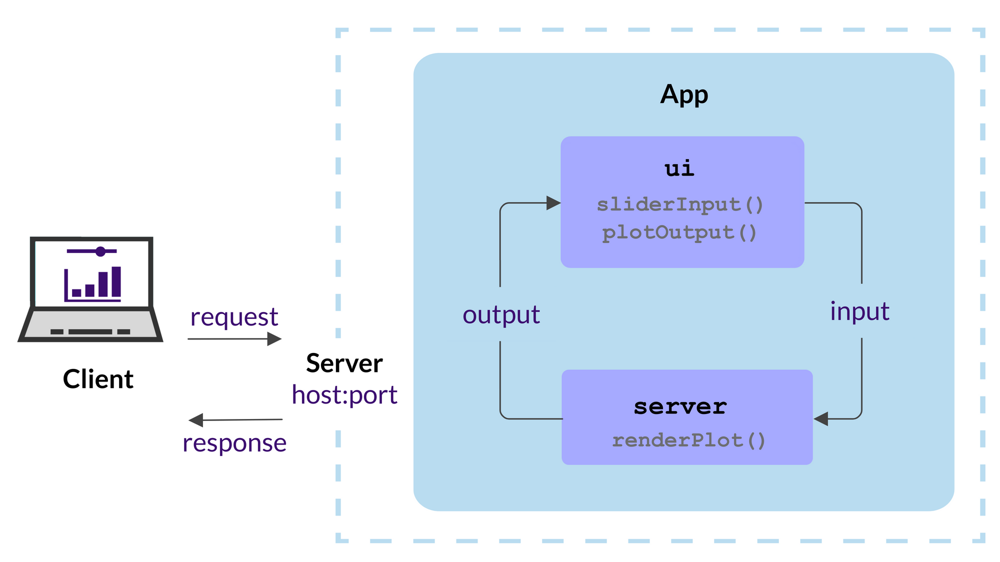
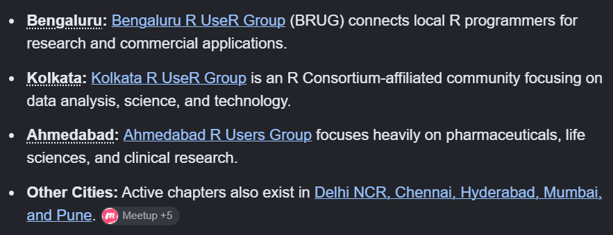
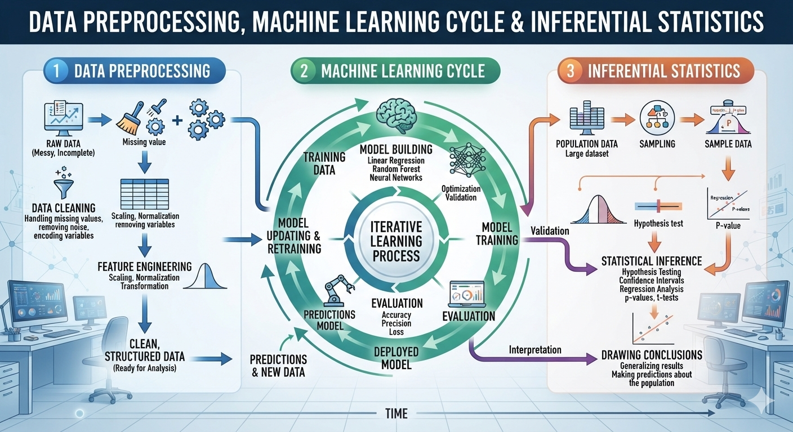
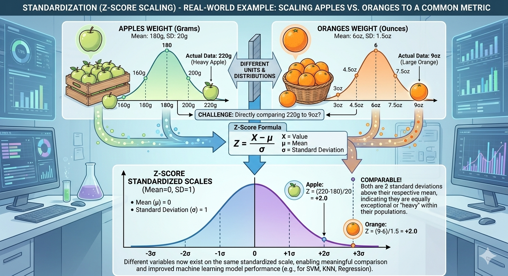
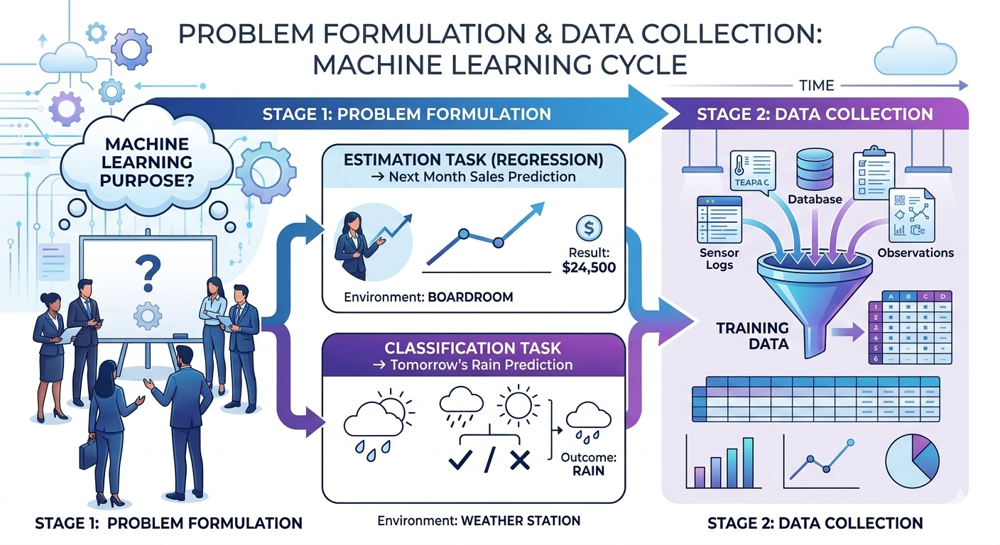

# Block I Unit 2

::: {.callout-note title="Chapter Outline"}

Fundamentals of R and RStudio, fundamentals of packages of RStudio, data manipulations, data transformations, normalization, standardization, missing values imputation, dummy variables, data visualization (2D and 3D), basic architecture of machine learning analytical cycle, descriptive analytics-case study covering data manipulation, measures of central tendency, measures of dispersion, measures of distribution, measures of associations, t-test, f-test, ANOVA, Chi-square test, basic statistical modeling framework.

:::

------------------------------------------------------------------------

## Fundamentals of R and RStudio

**Introduction to the R Ecosystem**

- **What is R and RStudio?**


The upper left part of Rstudio is script writing panel and used writing commands for the data science tasks.

The upper right part is console where we can see the output of the comands and terminal to access the terminal commands.

The lower left part shows the history of the project, environment and tutorials.

The lower right part contains the file structures of the projects, views the visual outputs like plots, presentations, web pages, etc. Help tab is useful to know about basics of the packages and commands.

------------------------------------------------------------------------

**Basic Workflow:** Creating projects, writing scripts, executing code in the console, and saving your work.


- Launch a Project by clicking on New Project
- Managing Project


------------------------------------------------------------------------

**Core Data Types and Operators**

- **Basic Data Types:** Working with numerics, integers, characters, logicals (boolean), and factors.

------------------------------------------------------------------------


------------------------------------------------------------------------

- **Basic Operators:** Implementing arithmetic `(+, -, *, /)`, assignment `(<-)`, and logical operators `(==, !=, <, >, >=, <=, &, |)`.

```{r}

2+2


```

```{r}

2-1


```

```{r}

2*3


```

```{r}

2/5


```

```{r}

D <- 3 + 5

D

```

```{r}

# 1. Setup sample data
x <- c(5, 12, 8)
y <- c(5, 3, 10)

# 2. Relational Operators (Returns a logical vector: TRUE or FALSE)
x == y   # Equal to?                -> TRUE FALSE FALSE
x != y   # Not equal to?            -> FALSE  TRUE  TRUE
x < y    # Less than?               -> FALSE FALSE  TRUE
x > y    # Greater than?            -> FALSE  TRUE FALSE
x <= y   # Less than or equal to?   -> TRUE FALSE  TRUE
x >= y   # Greater than or equal to?-> TRUE  TRUE FALSE

# 3. Logical Operators (Element-wise)
# Let's create two logical vectors
a <- c(TRUE, TRUE, FALSE)
b <- c(TRUE, FALSE, FALSE)

a & b    # Element-wise AND (Both must be TRUE) -> TRUE FALSE FALSE
a | b    # Element-wise OR (At least one TRUE)  -> TRUE  TRUE FALSE

```

- **Missing Data:** Understanding and identifying `NA`, `NaN`, and `NULL` values.


**R Data Structures**

- **Vectors:** Creating, indexing, and manipulating atomic vectors (the building blocks of R).

```{r}

# --- Using the combine function c() ---
numeric_vec   <- c(1.5, 2.8, 3.1)       # Double (numeric)
integer_vec   <- c(1L, 5L, 10L)         # Integer (note the 'L' suffix)
character_vec <- c("apple", "banana")   # Character (string)
logical_vec   <- c(TRUE, FALSE, TRUE)   # Logical (boolean)

numeric_vec
integer_vec
character_vec
logical_vec

```

```{r}

# --- Creating Sequences ---
seq_colon <- 1:10                       # Sequence from 1 to 10 by 1
seq_func  <- seq(from = 0, to = 1, by = 0.2) # c(0, 0.2, 0.4, 0.6, 0.8, 1.0)
seq_len   <- seq_len(5)                 # Safe sequence from 1 to 5

seq_colon

seq_func

seq_len

```

```{r}

# --- Creating Repeated Values ---
rep_vector <- rep(1:3, times = 3)       # c(1,2,3, 1,2,3, 1,2,3)
rep_each   <- rep(c("A", "B"), each = 2) # c("A", "A", "B", "B")

rep_vector
rep_each

```

- **Lists:** Structuring heterogeneous data collections.

List can contain any sort of data with varying length and formats.

```{r}

list_all = list(
                 numeric_vec,
                 integer_vec,
                 character_vec,
                 logical_vec,

                 seq_colon,
                 seq_func,
                 seq_len,

                 rep_vector,
                 rep_each

)

list_all

```

- **Matrices and Arrays:** Working with two-dimensional and multi-dimensional numeric data.

```{r}

# --- Creating a 3D Array ---
# Let's create an array with 3 rows, 4 columns, and 2 layers (3 x 4 x 2)
arr <- array(1:24, dim = c(3, 4, 2))

# --- Indexing & Subsetting ---
arr[1, 2, 1]  # Row 1, Column 2, Layer 1
arr[, , 2]    # Extracts the entire 2nd Layer (returns a 2D matrix)
arr[2, , ]    # Extracts Row 2 across all columns and layers

# --- Manipulating & Summarizing Arrays ---
# Apply a function across specific dimensions using apply()
# Calculate column sums for each layer (Margin 2 = Columns)
apply(arr, MARGIN = 2, FUN = sum)

# Combine two arrays along a dimension using abind (requires library)
# install.packages("abind")
# library(abind)
# combined_arr <- abind(arr, arr, along = 3) # Creates a 3 x 4 x 4 array

arr

```

- **Data Frames:** Creating, subsetting, and managing tabular data (the standard format for datasets).

```{r}

# --- Base R: Creating a Data Frame ---
df <- data.frame(
  employee_id = c(101, 102, 103, 104),
  name        = c("Alice", "Bob", "Charlie", "David"),
  salary      = c(75000, 62000, 81000, 95000),
  remote      = c(TRUE, FALSE, TRUE, TRUE),
  stringsAsFactors = FALSE # Standard practice in modern R
)

# --- Tidyverse: Creating a Tibble ---
# Note: Requires installing/loading the library: install.packages("tidyverse")
library(tibble)

tb <- tibble(
  employee_id = c(101, 102, 103, 104),
  name        = c("Alice", "Bob", "Charlie", "David"),
  salary      = c(75000, 62000, 81000, 95000),
  remote      = c(TRUE, FALSE, TRUE, TRUE)
)

df

tb

```

```{r}

# --- Subsetting Columns (Variables) ---
df$name               # Returns the "name" column as a vector
df[["salary"]]        # Also returns "salary" as a vector
df[, c("name", "salary")] # Returns a data frame with just those two columns

# --- Subsetting Rows (Observations) ---
df[1, ]               # Extracts the entire 1st row
df[1:3, ]             # Extracts rows 1 through 3

# --- Logical Subsetting (Filtering Rows) ---
# Find employees making more than $70,000
df[df$salary > 70000, ]

# Find employees who are remote AND making more than $80,000
df[df$remote == TRUE & df$salary > 80000, ]

```

```{r}

# --- Inspecting the Dataset ---
head(df, n = 2)       # View the first 2 rows
dim(df)               # Returns number of rows and columns (e.g., 4 4)
str(df)               # Displays the structure, data types, and contents
summary(df)           # Provides statistical summaries of numeric columns

# --- Adding and Modifying Columns ---
# Add a new column based on calculation
df$bonus <- df$salary * 0.10 

# Modify an existing column
df$salary <- df$salary + 2000

# --- Adding Rows ---
new_employee <- data.frame(employee_id = 105, name = "Eva", salary = 68000, remote = FALSE, bonus = 6800)
df <- rbind(df, new_employee)

# --- Sorting (Ordering) Data ---
# Sort the entire dataset by salary in descending order (-)
df_sorted <- df[order(-df$salary), ]

# --- Handling Missing Data (NA) ---
# Check which rows have missing data
is.na(df)

# Remove any rows containing missing values completely
df_clean <- na.omit(df)

```

**Data Importation and Exportation**

- **Working Directories:** Setting and managing your file paths using R projects.

_The Problem R Projects Solve_

New R users often write `setwd("C:/Users/Arun/Desktop/data")` at the top of every script. This breaks the moment the script moves to another computer, another folder, or another person's laptop. R Projects fix this permanently.

_Setting It Up_

1. **Create a Project**: File → New Project → New Directory (or Existing Directory) → give it a name.

2. This creates a `.Rproj` file in that folder — this file IS the anchor. Wherever this file sits, that becomes "home" whenever you open the project.

3. Double-click the `.Rproj` file (or open via RStudio's Project menu) to launch — RStudio automatically sets the working directory to that folder. **No `setwd()` needed, ever.**

_The One Rule to Teach_

**Never use `setwd()` with absolute paths. Always use paths relative to the project root.**

Instead of:

```{r}
#data <- read.csv("C:/Users/Arun/Desktop/MyProject/data/sales.csv")
```

Write:

```{r}
#data <- read.csv("data/sales.csv")
```

_Recommended Folder Structure_

Have students create this inside every new project:

MyProject/
├── MyProject.Rproj
├── data/          (raw data, never edited manually)
├── scripts/        (.R or .qmd files)
├── output/        (plots, results, reports)
└── README.md

_The `here` Package (strongly recommend)_

Even relative paths can break if a script is sourced from a subfolder. The `here` package solves this:

```{r}
#install.packages("here")
library(here)

#data <- read.csv(here("data", "sales.csv"))
#ggsave(here("output", "plot1.png"))
```

`here()` always resolves from the project root, no matter which subfolder the script runs from. Make this a habit from day one — it saves enormous debugging pain later.

_Quick Checklist for Students_

- [ ] Every analysis lives inside its own `.Rproj`
- [ ] Never hardcode a personal folder path
- [ ] Use `data/`, `scripts/`, `output/` subfolders
- [ ] Use `here::here()` instead of raw relative strings
- [ ] Check working directory anytime with `getwd()` — should always show the project folder

**Data Manipulation (Introduction to the Tidyverse)**

_Setup_

```{r}
library(tidyverse)
head(diamonds)  # already loaded, ~54,000 rows
```

1. The Pipe Operator

Both `%>%` and `|>` do the same thing — pass the object on the left into the function on the right.

```{r}
# Native pipe (R 4.1+) - recommended for students today
diamonds |> head()

# magrittr pipe - older, still common in tutorials/code online
diamonds %>% head()
```

2. Filtering and Selecting

```{r}
diamonds |>
  filter(cut == "Ideal", price > 5000) |>   # rows: only Ideal cut, expensive
  select(carat, cut, price, color)           # columns: keep only these
```

3. Sorting and Mutating

```{r}
diamonds |>
  mutate(price_per_carat = price / carat) |>   # new variable
  arrange(desc(price_per_carat)) |>            # sort, highest first
  select(carat, price, price_per_carat)
```

4. Summarizing Data

```{r}
diamonds |>
  group_by(cut) |>
  summarize(
    avg_price = mean(price),
    total_sales = sum(price),
    count = n()
  ) |>
  arrange(desc(total_sales))
```

This is the exercise that shows *why* the pipe matters — one readable chain instead of nested function calls:

```{r}
diamonds |>
  filter(price > 1000) |>
  mutate(price_per_carat = price / carat) |>
  group_by(color) |>
  summarize(
    avg_price = mean(price),
    avg_ppc = mean(price_per_carat),
    n = n()
  ) |>
  arrange(desc(avg_price))
```

**Pipe operators Reads left to right like a sentence:** *"Take diamonds, filter for price above 1000, create price-per-carat, group by color, summarize, then sort by average price descending."**

## Quick Exercise

Find: *"Which diamond `clarity` grade has the highest average price per carat, considering only diamonds under 2 carats?"*

HINT: `filter → mutate → group_by → summarize → arrange`


**Basic Data Visualization**

- **Base R Graphics:** Creating quick plots using `plot()`, `hist()`, and `boxplot()`.

```{r}

data("trees")

plot(trees$Girth, trees$Volume)

```


```{r}

hist(trees$Girth, n=30)

```


```{r}

boxplot(trees$Girth, horizontal = TRUE)

```


- **Introduction to ggplot2:** Understanding the grammar of graphics (Data, Aesthetics, Geoms).


`ggplot2` is the most versatile package to create basic to the advance level graphics and plots. You can visit the  [GGPLOT gallery](https://r-graph-gallery.com/), learn more about GGPLOT from this [LINK](https://ggplot2.tidyverse.org/articles/ggplot2.html) to see what `ggplot2` package is capable of. Checkout the [GGPLOT2 CHEATSHEET](https://rstudio.github.io/cheatsheets/html/data-visualization.html) and dedicated book [Data Visualization](https://r4ds.had.co.nz/data-visualisation.html). 

Some experts have used GGPLOT2 to create artistic plots and build career in data visualization and storytelling. Check following profiles of ggplot artists:

- [Riffomonas Project](riffomonas.org)

- [Albert Rapp](https://www.youtube.com/@rappa753)

- [Milo Makes Maps](https://www.youtube.com/@milos-makes-maps)

- **Essential Plot Types:** Building scatter plots, bar charts, line graphs, and histograms.
- **Customizing Plots:** Adding titles, changing axis labels, and applying basic themes.

_Anatomy of a Plot_

A plot is made up of layers shown as following:


_Components of a plot_

Therr are variety of components that make a plot. The following image shows the plot components and corresponding command from ggplot package to create that element:


Source: [Author Isabella Benabaye](https://share.google/vzISynxyvpx0seAnv)

_Steps to create a basic ggplot_

```{r}

# 1. Call the ggplot2 package from library

library(ggplot2)

# 2. Load data in ggplot

ggplot(data = ChickWeight)

# 3. Add aesthetics (x and y axis)

ggplot(data= ChickWeight, aes(x=Time, y=weight))

# 4. Add layers of type of plot, transformation or position adjustment using geoms

ggplot(data = ChickWeight, aes(x=Time, y=weight)) +
  geom_point() +                      #To create scatter plot
  geom_smooth(formula = y ~x, method = "lm")

# 5. Adding Scales to differentiate the different segments

ggplot(data = ChickWeight, aes(x=Time, y=weight, colour = as.factor(Diet))) +
  geom_point() +                      #To create scatter plot
  geom_smooth(formula = y ~x, method = "loess") + # Setting leoss rgression line
  scale_colour_viridis_d()    # Scale

# 6. Subsetting plot into facets if required

ggplot(data = ChickWeight, aes(x=Time, y=weight)) +
  geom_point() +                      #To create scatter plot
  facet_wrap(~Diet)                  # To create facets

# 7. Coordinates setting

ggplot(data = ChickWeight, aes(x=Time, y=weight)) +
  geom_point() +                      #To create scatter plot
  coord_fixed()                       # To set coordinates fixed ratio  as per scale

ggplot(data = ChickWeight, aes(x=Time, y=weight)) +
  geom_point() +                      #To create scatter plot
  coord_fixed(0.5)                       # To set coordinates fixed ratio  as per choice


ggplot(data = ChickWeight, aes(x=Time, y=weight)) +
  geom_point() +                      #To create scatter plot
  coord_fixed(1.5)                       # To set coordinates fixed ratio  as per choice

ggplot(data = ChickWeight, aes(x=Time, y=weight)) +
  geom_point() +                      #To create scatter plot
  coord_fixed(0.01)                       # To set coordinates fixed ratio  as per choice

# 8. Adding theme to the plot (title, subtitle, axis label, plot background, graph background, caption, annotation, font size, font type, font formats, etc.)

ggplot(data = ChickWeight, aes(x=Time, y=weight, colour = Diet)) +
  geom_point() +                      #To create scatter plot
  coord_fixed(0.01) +                 # To set coordinates
  labs(
    title = "Chick Development Analysis",
    subtitle = "Outcomes of an experiment with 578 Chicks",
    caption = "Study done by students of Agri MBA-2 Batch 2024-26 in May 2026 at IABM",
    x = "Time in Days",
    y = "Weight in gram"
  ) +
  theme(
      plot.title = element_text(face = "bold", size = 14),
      plot.subtitle = element_text(face = "bold", size = 9, color="grey70"),
      axis.title.y = element_text(color = "darkblue"),
      axis.title.x = element_text(color = "darkgreen")
    )

```


:::{.callout-important title= "Assignment 2.1"}

Use any inbuilt dataset in R and create 5 different visuals using `ggplot2` package. (Visit GGplot Gallery for the help).

:::

---

**Programming Fundamentals in R**

- **Conditional Logic:** Writing `if`, `else if`, and `else` statements.

_Basic Syntax_


if (condition) {
  # code if TRUE
} else if (another_condition) {
  # code if that's TRUE
} else {
  # code if none are TRUE
}


Example 1: Simple `if`

```{r}
age <- 20

if (age >= 18) {
  print("You are an adult")
}
```

Try changing age value 15, 17.5 and 21 and check if else statement is properly working or not.

Example 2: `if` / `else`

```{r}
marks <- 45

if (marks >= 40) {
  print("Pass")
} else {
  print("Fail")
}
```

Check the if lese statement command for marks 35 and 50.

Example 3: `if` / `else if` / `else` (grading system)

```{r}
marks <- 78

if (marks >= 90) {
  print("Grade: A")
} else if (marks >= 75) {
  print("Grade: B")
} else if (marks >= 60) {
  print("Grade: C")
} else if (marks >= 40) {
  print("Grade: D")
} else {
  print("Grade: F")
}
```

Check the Grade for Marks 40, 70, and 90.

Example 4: Using it inside a function (practical, real-world style)

```{r}
check_bmi <- function(bmi) {
  if (bmi < 18.5) {
    return("Underweight")
  } else if (bmi < 25) {
    return("Normal")
  } else if (bmi < 30) {
    return("Overweight")
  } else {
    return("Obese")
  }
}

check_bmi(27)   # "Overweight"
check_bmi(21)   # "Normal"
```

Example 5: Vectorized alternative — `ifelse()`

Regular `if` only checks **one value at a time**. When you need to apply a condition across an entire column/vector (very common with sales/data work), use `ifelse()` instead:

```{r}
scores <- c(45, 88, 62, 30, 95)

result <- ifelse(scores >= 50, "Pass", "Fail")
print(result)

```

Common Mistake to Warn Students About

`else` **must** be on the same line as the closing `}` of the `if` block — otherwise R throws an error (especially when running line-by-line in a script).

```{r}
# # WRONG (in a script run line-by-line)
# if (age >= 18) {
#   print("Adult")
# }
# else {
#   print("Minor")
# }

# CORRECT
if (age >= 18) {
  print("Adult")
} else {
  print("Minor")
}
```

**Quick Exercise**

Write a function `classify_diamond(price)` that returns `"Budget"` if price < 1000, `"Mid-range"` if price < 5000, and `"Luxury"` otherwise — then test it using values pulled from the `diamonds$price` column.

---

- **Vectorized Operations:** Leveraging R's native speed instead of traditional loops.

_The Core Idea_

R is built to operate on entire vectors at once, not element-by-element like traditional loops. Vectorized code is faster, shorter, and more "R-like."

```{r}
x <- c(1, 2, 3, 4, 5)
x * 2
# 2 4 6 8 10   — every element multiplied, no loop needed
```

Example 1: Loop vs. Vectorized (the classic comparison)

**Slow, traditional way (loop):**

```{r}
x <- 1:1000000
result <- numeric(length(x))

for (i in seq_along(x)) {
  result[i] <- x[i] * 2
}
```

**Fast, vectorized way:**
```{r}
x <- 1:1000000
result <- x * 2
```

Same output — but the vectorized version runs dramatically faster because R's internal C code handles the looping, not R itself.

Example 2: Conditional Logic — `ifelse()` Instead of a Loop

```{r}
scores <- c(45, 88, 62, 30, 95)

# Loop way (avoid this)
result <- character(length(scores))
for (i in seq_along(scores)) {
  if (scores[i] >= 50) result[i] <- "Pass" else result[i] <- "Fail"
}

# Vectorized way (do this)
result <- ifelse(scores >= 50, "Pass", "Fail")
```

Example 3: Applying a Function Across a Vector

```{r}
prices <- c(1200, 450, 3400, 800, 5200)

# No loop needed — sqrt() is already vectorized
sqrt(prices)

# Custom logic without a loop, using ifelse()
category <- ifelse(prices < 1000, "Budget",
             ifelse(prices < 5000, "Mid-range", "Luxury"))
```

Example 4: Vectorized Math on Data Frame Columns

```{r}
diamonds$price_per_carat <- diamonds$price / diamonds$carat
```

No loop, no `apply()` — one line operates on all ~54,000 rows simultaneously.

Example 5: Logical Indexing (a vectorized filter)

```{r}
x <- c(10, 25, 3, 47, 8, 62)

x[x > 20]        # 25 47 62 — pulls all elements matching the condition
sum(x > 20)      # 3 — counts how many meet the condition
```

When You *Do* Still Need a Loop

Vectorization doesn't cover everything — use loops when each step depends on the *previous* result (e.g., simulations, recursive calculations):

```{r}
balance <- numeric(10)
balance[1] <- 1000
for (i in 2:10) {
  balance[i] <- balance[i-1] * 1.05   # depends on prior value
}
```

The Rule of Thumb to Teach

**If you're writing a `for` loop to do simple math or apply a condition to a whole column — stop. There's almost always a vectorized way.**

**Quick Exercise**

Here is the 20 chick weights:

60, 120, 221, 175, 80,
280, 305, 155, 98, 103,
200, 190, 352, 75, 180,
210, 198, 98, 98, 170

Classify each chick as `"Low"`, `"Medium"`, or `"High"` using nested `ifelse()` — then time it against a loop-based version using `system.time()` to see the speed difference themselves.


- **Basic Loops:** Understanding `for` and `while` loops for repetitive tasks.

_`for` Loop — When You Know How Many Times to Repeat_

```{r}
for (i in 1:5) {
  print(i)
}
# 1 2 3 4 5
```

Example 1: Looping Over a Vector

```{r}
fruits <- c("Apple", "Banana", "Mango")

for (f in fruits) {
  print(paste("I like", f))
}
```

Example 2: Looping With an Index (common in data work)

```{r}
prices <- c(100, 250, 400)

for (i in 1:length(prices)) {
  cat("Item", i, "costs Rs.", prices[i], "\n")
}
```

**Tip:** prefer `seq_along(prices)` over `1:length(prices)` — it safely handles an empty vector (`1:0` gives `1, 0`, which breaks the loop).

```{r}
for (i in seq_along(prices)) {
  cat("Item", i, "costs Rs.", prices[i], "\n")
}
```

Example 3: Accumulating a Result

```{r}
total <- 0
sales <- c(1200, 450, 3400, 800)

for (s in sales) {
  total <- total + s
}
print(total)   # 5850
```

(Note: `sum(sales)` does this in one vectorized line — loops are for teaching the *concept*, but real code should prefer vectorization once understood.)

_`while` Loop — When You Don't Know the Number of Iterations in Advance_

Repeats **as long as a condition stays TRUE**.

```{r}
count <- 1

while (count <= 5) {
  print(count)
  count <- count + 1
}
```


Example 4: `while` Loop — Practical Case (compounding until a target is hit)

```{r}
balance <- 1000
years <- 0

while (balance < 2000) {
  balance <- balance * 1.08   # 8% annual growth
  years <- years + 1
}

cat("It took", years, "years to double the balance.\n")
```

This is the kind of problem `while` is made for — you genuinely don't know the iteration count upfront.

_`break` and `next` — Controlling Loop Flow_

```{r}
# break — stop the loop early
for (i in 1:10) {
  if (i == 5) break
  print(i)
}
# 1 2 3 4

# next — skip this iteration, continue looping
for (i in 1:10) {
  if (i %% 2 == 0) next   # skip even numbers
  print(i)
}
# 1 3 5 7 9
```

_Common Mistake to Warn Students About_

Forgetting to update the counter in a `while` loop causes an **infinite loop**:

```{r}
# WRONG — never stops
#count <- 1
#while (count <= 5) {
#  print(count)
  # forgot: count <- count + 1
#}
```

If this happens in RStudio, hit the **red stop icon** (or `Esc`) to break out.

_`for` vs `while` — Quick Rule of Thumb_

| Use `for` when... | Use `while` when... |
|---|---|
| You know the number of iterations | You don't know how many iterations you'll need |
| Looping over a fixed vector/list | Looping until a condition is met |

**Quick Exercise**

Using a `while` loop,  find how many months it takes an LIC premium of ₹5,000 growing at 0.5% monthly interest to cross ₹6,000 — then solve the same problem with a `for` loop capped at 50 iterations using `break` once the target is hit.

---

- **Writing Custom Functions:** Building reusable code blocks with inputs and outputs.

_Basic Syntax_

```r
function_name <- function(arg1, arg2) {
  # code using arg1, arg2
  return(result)
}
```

Example 1: Simple Function

```{r}
square <- function(x) {
  return(x^2)
}

square(5)   # 25
```


Example 2: Multiple Arguments

```{r}
calculate_bmi <- function(weight, height) {
  bmi <- weight / (height^2)
  return(bmi)
}

calculate_bmi(70, 1.75)   # 22.86
```

Example 3: Default Argument Values

```{r}
greet <- function(name, greeting = "Hello") {
  paste(greeting, name)
}

greet("Amita")                    # "Hello Arun"
greet("Amita", "Good morning")    # "Good morning Arun"
```

Example 4: Combining a Function With `if`/`else` (very common pattern)

```{r}
classify_diamond <- function(price) {
  if (price < 1000) {
    return("Budget")
  } else if (price < 5000) {
    return("Mid-range")
  } else {
    return("Luxury")
  }
}

classify_diamond(3200)   # "Mid-range"
```

Example 5: Function That Returns Multiple Values (via a list)

```{r}
sales_summary <- function(sales) {
  list(
    total = sum(sales),
    average = mean(sales),
    highest = max(sales)
  )
}

result <- sales_summary(c(1200, 450, 3400, 800))
result$total      # 5850
result$average    # 1462.5
result$highest    # 3400
```


Example 6: A Vectorized Custom Function (works on a whole column, no loop)

```{r}
premium_with_gst <- function(base_premium, gst_rate = 0.18) {
  base_premium * (1 + gst_rate)
}

# Works on a single value
premium_with_gst(5000)          # 5900

# Also works on an entire vector at once — no loop needed
premiums <- c(5000, 8000, 12000)
premium_with_gst(premiums)      # 5900  9440  14160
```

**Quick Exercise**

Write a function `lic_maturity(premium, years, rate = 0.06)` that calculates simple maturity value as `premium * years * (1 + rate)`, then apply it to a vector of different premium amounts to show it working without a loop.

---

**Introduction to Git & GitHub**

Git = version control software installed on your computer. Tracks changes to files over time.
GitHub = a website that hosts Git repositories online, so you can back up code and collaborate with others.

Think of Git as the engine, GitHub as the cloud garage where you park it.

_The Three Pieces — What Each One Does_

| Tool | What it is |
|---|---|
| **Git** | Version control engine installed on your computer |
| **GitHub** | Website that hosts repositories online |
| **GitHub Desktop** | A visual app that runs Git commands via buttons/clicks — no terminal needed |

GitHub Desktop doesn't replace Git — it's a friendly face on top of it.

_Step 1: Install Everything_

1. Install **Git**: [git-scm.com](https://git-scm.com)
2. Create a **GitHub** account: [github.com](https://github.com)
3. Install **GitHub Desktop**: [desktop.github.com](https://desktop.github.com)
4. Open GitHub Desktop → sign in with your GitHub account (File → Options → Accounts)

_Step 2: Create a Repository — Two Ways_

**A. Command line:**

```bash
git init
git config --global user.name "Amita Sharma"
git config --global user.email "your_email@example.com"
```

**B. GitHub Desktop (recommended for beginners):**

- File → New Repository
- Name it, choose local folder, pick "R" in the Git Ignore template
- Click **Create Repository**

## Step 3: Making Changes — The Core Workflow

**Command line:**
```bash
git add .
git commit -m "Added data cleaning script"
git push
```

**GitHub Desktop:**
1. Edit your R script/file as normal.
2. Open GitHub Desktop — changed files appear automatically in the left panel with a diff view (green = added, red = removed).
3. Type a commit message in the box at bottom-left → click **Commit to main**.
4. Click **Push origin** (top bar) to send it to GitHub.

GitHub Desktop's diff view is genuinely useful pedagogically — students *see* exactly what changed line-by-line before committing, which the terminal doesn't show as clearly.

_Step 4: Connecting Local ↔ GitHub Website_

**Command line:**
```bash
git remote add origin https://github.com/username/repo-name.git
git branch -M main
git push -u origin main
```

**GitHub Desktop:**

- After creating a repo locally: **Repository → Push** — it auto-creates the matching repo on GitHub and links it (if not already linked), no manual `remote add` needed.
- Or: File → Clone Repository → paste the GitHub URL → choose local folder.

_Step 5: Branching (Both Ways)_

**Command line:**
```bash
git checkout -b feature-x
git checkout main
git merge feature-x
```

**GitHub Desktop:**

- Top bar → **Current Branch** dropdown → **New Branch** → name it.
- Switch branches from the same dropdown.
- To merge: switch to `main` → **Branch menu → Merge into current branch** → pick `feature-x`.

_Step 6: History & Undoing_

**Command line:**
```bash
git log --oneline
git checkout -- filename.R
git revert <commit-hash>
```

**GitHub Desktop:**

- **History tab** (next to Changes tab) shows every commit visually with diffs.
- Right-click any file in Changes → **Discard changes** (same as `checkout --`).
- Right-click a commit in History → **Revert this commit**.

`.gitignore` for R Projects

Same file either way — GitHub Desktop auto-adds one if you pick "R" as the template at repo creation:

```
*.Rhistory
*.RData
.Rproj.user/
data/raw/
```

_Which Should Students Use Day-to-Day?_

- **Learning phase:** GitHub Desktop — visual feedback builds intuition fast, fewer typo-related errors.
- **Once comfortable:** Push them to the terminal — real jobs and RStudio's Git pane (Terminal tab) expect command-line fluency, and Desktop can't do everything (e.g., interactive rebase, cherry-picking).

**Quick Exercise**

Create a repo in GitHub Desktop → make 3 commits with meaningful messages (visible in the History tab) → push to GitHub → then open a terminal in that same folder and run `git log --oneline` to confirm the same 3 commits appear identically from the command line.

---

**Documentation Production in R**

R is not only about programming language and analysis. You can use to produce variety of documents like manuscript, books, presentations, website, reports, interactive documents (word, pdf), etc.


Visit the gallery of Quardo Documentation: [Click](https://quarto.org/docs/gallery/)

**Dashboards and Shiny Apps**

- **Quarto Dashboards:** Building interactive, responsive grid layouts with rows, columns, tabs, and value boxes directly from markdown.

- **Introduction to Shiny:**

`Shiny` is the web application framework to create interactive web application and distribute it among the users through a shareable link. Watch out the Shiny Apps Gallery:


A Shiny app always carries two R files called as `ui.R` and `server.R`. The `ui.R` file builds the interface which interacts with users and takes inputs from users while `server.R` does backend calculations and sends output to the user interface. 



Shiny apps can be used to create interactive document, web application, and dashboard. Check few live shiny apps:


To build high quality Shiny apps, following book (FREE) is recommended:


To build production grade shiny apps which can be used by thousands of users, read following resource:


---

**R/Posit Communities**

The classroom learning is only 5% learning. To build real skills for the industry, you are required to communicate with professional networks of R users. These networks help in removing bugs, errors, problems and issues you will encounter while developing projects in R. sFollowing are the platforms to develop a thriving network with R users:

- **Navigating the Ecosystem:** 

[Official Posit community forums](https://forum.posit.co/)

[Standardized cheat sheets](https://opensource.posit.co/resources/cheatsheets/)

- **Collaborative Learning Networks:** Engaging with regional R User Groups (RUGs), R-Ladies chapters, and the global `#rstats` community:



The global R user community group:


Use these communities to get help and give help. Remember, you can get a quality placement useing these networking platforms. Interact with authors, give them credits for their help and extend your help are the hidden tactics to get quality projects and jobs. 

- **Continuous Skill Building:** Leveraging open source initiatives like *TidyTuesday*, kaggle.com, hackerearth.com, analyticsvidya.com, etc. to practice data manipulation and visualization safely.


---

**Other Parts of R Ecosystem**

- **Package Management Lifecycle:** Installing, updating, and loading extensions safely using `install.packages()`, `library()`, and CRAN mirrors.

- **Reproducible Environments:** Introduction to `renv` for locking down package versions to prevent project-breaking dependency updates.

- **Specialised R Sub-Ecosystems:** A high-level overview of ecosystem expansions like `tidymodels` for machine learning and `sf` / `terra` for geospatial analysis.

`tidymodels` and `tidyverse` are the most versatile packages to carryout heavy lifting machine learning tasks with simple line of codes using pipe operators, We will discuss these packages in detail in the next units od the course. To gain expertise on these packages, you can visit following resources:


:::{.callout-important}

If you learn `tidymodels` and `tidyverse` packages thoroughly, majority of machine learning and data analysis tasks can be done through these packages only.

:::

------------------------------------------------------------------------

## Data Preprocessing, Machine Learning Cycle & Inferential Statistics




**Data Transformations and Preprocessing**

When organisations collect data, they do it for their administrative purposes not for using machine learning tasks and advance level data analysis. In machine learning, various model building algorithms are used. Machine learning model uses the data in specific formats. 

There are various machine learning algorithms in supervised machine learning. Superwised machine learning algorithms are used either to predict the future values or classify an obervation from tow or more categories. 

For example, a company wants to know what will the next month sales based on last five years sales. This is an estimation problem. Machine learning algorithms which can bsed used to create model are linear regression, lasso regression, ElasticNet regression,random forest, decision tree, XGBoost, Support Vector Machine, k-Nearest Neighbours, Multi Layer Perceptron, Recurrent Neural Net, etc.

To classify an observations in given catgories, we use classification machine learning algorithms. To mention a few; decision tree, logistic regression, random forest, naive Bayes, k-NN, Support Vector Machine, XGBoost, Multi Layer Perceptron, Convolutional neural Network, etc. 

You can notice that some of the algorithm works in both types of tasks. 

Data preprocessing is the step to prepare the data for machine learning tasks so that all data is in ht right format. Following are steps in data preprocessing:

- **Normalization (Min-Max Scaling):** Rescaling feature values to a constrained range between 0 and 1.

Sometimes, we need to scale the data so that comparison of the variables is possible. For example, we can not compare height in inches with weight in kilogram because both carry different units. 

To get them on same scale, we normalize the data by doing Min-Max scaling. 

```{r}

# Normalization (Min-Max Scaling) Formula:
# x_scaled = (x - min(x)) / (max(x) - min(x))

# 1. Base R Approach
normalize_base <- function(x) {
  return((x - min(x)) / (max(x) - min(x)))
}

# Example numeric vector
data_vector <- c(10, 20, 30, 40, 50)
normalized_vector <- normalize_base(data_vector)
print(normalized_vector)
# Output: 0.00 0.25 0.50 0.75 1.00


# 2. Tidyverse Approach (For entire data frames using caret or recipes)
library(recipes)

# Sample dataset
df <- data.frame(
  income = c(25000, 48000, 110000, 85000),
  age = c(21, 34, 56, 42)
)

# Create and run a preprocessing recipe
min_max_recipe <- recipe(~ ., data = df) %>%
  step_range(all_numeric_predictors(), min = 0, max = 1) %>%
  prep()

normalized_df <- bake(min_max_recipe, new_data = df)
print(normalized_df)

```


- **Standardization (Z-Score Scaling):** Transforming features to have a mean of 0 and a standard deviation of 1.

Another way to scale different variables on the same scale is Z-Score scaling in which comparing variables are re-culculated by keeping mean zero and standar deviation 1. See this concept from following image: 




---


- **Missing Values Imputation:** Evaluating strategies for handling incomplete data, including listwise deletion, mean/median substitution, and predictive imputation using `mice` or `missMDA`. Let us understand by the example:

Setup Sample Missing Dataset

First, let's create a small data frame containing missing values (NA) to test our strategies.

```{r}
# Create a sample dataset with missing values
set.seed(42)
df <- data.frame(
  Age = c(25, 30, NA, 45, 50, NA, 35, 40),
  Income = c(50000, 60000, 52000, NA, 95000, 105000, NA, 82000),
  Score = c(85, 88, 72, 90, NA, 65, 78, 85)
)

print("Original Data with NAs:")
print(df)

```


1. Listwise Deletion (Complete Case Analysis)

This removes any row that contains at least one missing value. Use this only if data is missing completely at random (MCAR) and you have plenty of data left over.

Method A: Base R

```{r}

clean_df_base <- na.omit(df)

```


Method B: Tidyverse

```{r}
library(tidyr)
clean_df_tidy <- df %>% drop_na()

print("After Listwise Deletion:")
print(clean_df_tidy)
```

2. Mean / Median Substitution

This replaces missing values with the average or middle value of that specific column. It is simple but artificially reduces the variance of your data.

```{r}

library(dplyr)

# Impute Age with Median and Income/Score with Mean
imputed_simple <- df %>%
  mutate(
    Age = ifelse(is.na(Age), median(Age, na.rm = TRUE), Age),
    Income = ifelse(is.na(Income), mean(Income, na.rm = TRUE), Income),
    Score = ifelse(is.na(Score), mean(Score, na.rm = TRUE), Score)
  )

print("After Mean/Median Substitution:")
print(imputed_simple)
```

3. Predictive Imputation via mice (MICE Algorithm)

Multivariate Imputation by Chained Equations (MICE) creates multiple plausible imputations by modeling each feature with missing values as a function of the other features in the data.

```{r}

# Install package if needed: install.packages("mice")
library(mice)

# Run the MICE algorithm (m=5 creates 5 imputed datasets; maxit=5 sets iterations)
# 'pmm' stands for Predictive Mean Matching (great for numeric features)
mice_imputed <- mice(df, m = 5, maxit = 5, method = 'pmm', seed = 42, printFlag = FALSE)

# Extract one of the complete datasets (e.g., the 1st iteration)
completed_df_mice <- complete(mice_imputed, 1)

print("After MICE Predictive Imputation:")
print(completed_df_mice)
```

4. Predictive Imputation via missMDA (PCA-based)

The missMDA package handles missing data using Principal Component Analysis (PCA). It excels at keeping the dimensional structure and correlations between variables intact.

```{r}

# Install package if needed: install.packages("missMDA")
library(missMDA)

# Step 1: Estimate the number of dimensions/components to use for imputation
num_components <- estim_ncpPCA(df, ncp.max = 2)

# Step 2: Perform PCA imputation based on estimated dimensions
pca_imputation <- imputePCA(df, ncp = num_components$ncp)

# Step 3: Extract the completed dataset matrix and convert to data frame
completed_df_pca <- as.data.frame(pca_imputation$completeObs)

print("After missMDA (PCA) Imputation:")
print(completed_df_pca)
```

Comparison of Methods

| Strategy | When to Use | Key Risk |
|---|---|---|
| Listwise Deletion | Drop rate is < 5% and data is missing completely at random. | Loses valuable data and can introduce heavy bias. |
| Mean/Median | Fast baseline calculations on simple datasets. | Destroys correlations and artificially deflates standard deviation. |
| mice (MICE) | General tabular data; protects relationships between columns. | Computationally intensive on very large datasets. |
| missMDA (PCA) | Datasets with highly correlated variables or multi-collinearity. | Assumes linear relationships across components. |

---

- **Dummy Variables (One-Hot Encoding):** Converting categorical string values into numerical binary vectors (`0` or `1`) for machine learning models.

```{r}

# Create a sample dataset with categorical text fields
df <- data.frame(
  CustomerID = 1:5,
  Region = c("North", "South", "East", "North", "South"),
  Device = c("Mobile", "Desktop", "Mobile", "Tablet", "Desktop")
)
print("Original Data:")
print(df)

```

Now, we convert categorical variable into dummy variables:

```{r}

# Install if needed: install.packages("recipes")
library(recipes)

# Define the transformation recipe
rec <- recipe(~ ., data = df) %>%
  step_dummy(all_nominal_predictors(), one_hot = TRUE) %>% # Convert text columns to dummies
  prep()

# Apply the transformation matrix to your data
df_recipes_dummies <- bake(rec, new_data = df)

print("With Tidyverse Recipes:")
print(df_recipes_dummies)

```

Why we need to create dummy variable instead of original variable? Because many machine learning algorithms do not read categorical data and need only numeric form of data.  

---

**Basic Architecture of Machine Learning Analytical Cycle**

- **Problem Formulation & Data Collection:** Defining predictive tasks (Classification vs. Estimation) and gathering primary structural observations.

This s very important part of a machine learning project cycle. This sets the core purpose of the machine learning project. As there are two types of tasks - classification and estimation; this must be defined clearly. 

A business wants to predict the next month sales is an estimation tasks while tomorrow, there will be rain or not is a classification problem. 



- **Data Cleansing & Feature Engineering:** Formatting raw records, refining variables, and performing exploratory data analysis (EDA).

Before applying machine learning models, each variable, pairs of variables are analyzed through Exploratory Data Analysis. Exploratory data analysis(EDA) is useful in defining the pathway to select the machine learning tasks and model building process, though EDA is directly not involved in machine learning tasks and model building process. We will discuss this in more detail in the next units. 

- **Model Training & Evaluation:** Partitioning datasets into Train/Test splits, validating model performance with metrics (RMSE, Accuracy), and tuning hyperparameters.

Once data is preprocessed and EDA is done, data is split into training and testing. Model is trained on training data using appropriate machine learning algorithm and model is validated/tested for accuracy on testing data. This process is repeated again and again to improve the model by doing hyperparameter tuning. 

Once highest accuracy is achieved, model is ready for deployment and become available for real world use cases. For estimation  tasks, we use Root Mean Squared Error and for classification tasks, we use confusion matrix to check accuracy of the model.

There are numerous other metrices we use to check evaluate machine learning models. 

- **Deployment & Monitoring:** Packaging analytical cycles into reproducible code pipelines or production environments.

Once ML model is built, the model should be hosted in the cloud server so that model can be accessed through a web application. With `shiny` framework, we can create web app using the ML model. Afterwards, the app is hosted in the cloud with proper subscriptions and authorization. There are various cloud storage options available like shinyapps.io, R Posit Connect, etc. 

Once web app is successfully hosted in the cloud, a web link is generated that can be shared to the users. 


---

**Descriptive Analytics Case Study (Covering Data Manipulation)**

- **Measures of Central Tendency:** Computing and interpreting the Median, Mean, and Mode for varying structural distributions.

1. The Core Functions (Base R & Tidyverse)

```{r}
library(dplyr)

# Custom function to find the statistical Mode
get_mode <- function(x) {
  unique_x <- unique(x)
  unique_x[which.max(tabulate(match(x, unique_x)))]
}

# Create a sample numeric vector
data_vector <- c(10, 20, 20, 30, 40, 50, 90)

# Base R Approach
mean_val   <- mean(data_vector)
median_val <- median(data_vector)
mode_val   <- get_mode(data_vector)

print(paste("Mean:", mean_val, "| Median:", median_val, "| Mode:", mode_val))
# Output: "Mean: 37.14 | Median: 30 | Mode: 20"

```


2. Computing Central Tendency Across Different Distributions

The position of these three metrics tells you exactly how your data is distributed. Let's create three different structural scenarios to see how they change.

```{r}

# Set seed for reproducible random numbers
set.seed(123)

# Generate 3 different structural distributions
distributions_df <- data.frame(
  # 1. Symmetric (Normal Distribution)
  Symmetric = rnorm(1000, mean = 50, sd = 10),
  
  # 2. Right-Skewed (Log-Normal Distribution - e.g., Income, Wealth)
  Right_Skewed = rlnorm(1000, meanlog = 3.5, sdlog = 0.5),
  
  # 3. Left-Skewed (Beta Distribution scaled - e.g., Age of Retirement)
  Left_Skewed = rbeta(1000, shape1 = 5, shape2 = 2) * 100
)

# Compute Mean and Median for all distributions simultaneously using dplyr
summary_table <- distributions_df %>%
  summarise(across(everything(), list(
    Mean = ~ mean(.),
    Median = ~ median(.)
  ), .names = "{.col}_{.fn}"))

print(t(summary_table)) # Transpose for cleaner reading

```


3. How to Interpret the Metrics Based on Data Structure

When analyzing data shapes in machine learning, remember these rules of thumb:

| Distribution Shape | Visual Behavior | Mathematical Relationship | Best Metric to Use |
|---|---|---|---|
| Symmetric | Perfectly balanced bell curve. | Mean $\approx$ Median $\approx$ Mode | Mean (Utilizes all data points efficiently). |
| Right-Skewed (Positive) | Long tail pulls out to the high/right side. | Mean $>$ Median $>$ Mode | Median (The Mean is falsely dragged upward by high outliers). |
| Left-Skewed (Negative) | Long tail pulls out to the low/left side. | Mean $<$ Median $<$ Mode | Median (The Mean is falsely dragged downward by low outliers). |

Quick example of how outliers ruin the Mean but don't affect the Median

```{r}

house_prices <- c(250000, 275000, 300000, 310000, 320000)
print(mean(house_prices)) # Output: 291000

# Add a multi-million dollar mansion outlier
house_prices_with_outlier <- c(250000, 275000, 300000, 310000, 320000, 5000000)

print(mean(house_prices_with_outlier))   # Output: 1,075,833 (Terrible representation of the neighborhood)
print(median(house_prices_with_outlier)) # Output: 305,000 (Robust and accurate representation)

```


Setup: Carrying Forward the Distributions

```{r}

library(dplyr)
library(tidyr)

# Carry forward the exact same distributions from the previous step
set.seed(123)
distributions_df <- data.frame(
  Symmetric = rnorm(1000, mean = 50, sd = 10),
  Right_Skewed = rlnorm(1000, meanlog = 3.5, sdlog = 0.5),
  Left_Skewed = rbeta(1000, shape1 = 5, shape2 = 2) * 100
)

```


1. Measures of Dispersion

These metrics quantify how spread out or variable your data points are around their central tendency.

```{r}

# Function to calculate the range spread (Max - Min)
get_range <- function(x) { max(x) - min(x) }

# Compute Dispersion metrics across all columns
dispersion_summary <- distributions_df %>%
  summarise(across(everything(), list(
    Range = ~ get_range(.),
    Variance = ~ var(.),
    Std_Dev = ~ sd(.),
    IQR = ~ IQR(.)
  ), .names = "{.col}_{.fn}"))

# Pivot for a clean, readable overview matrix
dispersion_summary %>% 
  pivot_longer(cols = everything(), names_to = c("Variable", "Metric"), names_sep = "_") %>% 
  pivot_wider(names_from = Metric, values_from = value)

```


2. Measures of Distribution (Shape)

To calculate Skewness (asymmetry) and Kurtosis (thickness of the tails), we use the industry-standard moments package.

```{r}

# Install package if needed: install.packages("moments")
library(moments)

shape_summary <- distributions_df %>%
  summarise(across(everything(), list(
    Skewness = ~ skewness(.),
    Kurtosis = ~ kurtosis(.)
  ), .names = "{.col}_{.fn}"))

shape_summary %>% 
  pivot_longer(cols = everything(), names_to = c("Variable", "Metric"), names_sep = "_") %>% 
  pivot_wider(names_from = Metric, values_from = value)

```

How to Interpret the Shape Metrics:

* Skewness: A symmetric distribution scores around 0. The Right_Skewed data returns a high positive score (long right tail), while the Left_Skewed data returns a negative score (long left tail).

* Kurtosis: A standard normal distribution has a kurtosis of 3. Scores higher than 3 indicate heavy tails with extreme outlier peaks (Leptokurtic), typical of our log-normal Right_Skewed dataset.

3. Measures of Association

To evaluate how variables move together, we will calculate Covariance and compare Pearson Correlation (linear relationships) vs. Spearman Correlation (rank/monotonic relationships).

```{r}

# A. Covariance Matrix
cov_matrix <- cov(distributions_df)
print("Covariance Matrix:")
print(round(cov_matrix, 3))

```


```{r}

# B. Pearson Correlation Matrix (Best for linear, normally distributed features)
pearson_matrix <- cor(distributions_df, method = "pearson")
print("Pearson Correlation Matrix:")
print(round(pearson_matrix, 3))

```


```{r}

# C. Spearman Rank Correlation Matrix (Best for skewed features or non-linear trends)
spearman_matrix <- cor(distributions_df, method = "spearman")
print("Spearman Correlation Matrix:")
print(round(spearman_matrix, 3))

```


Why comparing Pearson vs. Spearman matters in Data Preprocessing:

If you compare the correlation metrics between Symmetric and Right_Skewed variables, you will notice their Spearman score is often more robust than their Pearson score. Because Pearson relies on strict linearity, highly skewed variables distort the coefficient. Spearman bypasses this limitation by ranking the data points first, making it a critical choice during feature selection loops.

Now that you have the statistical summaries ready, would you like to:

* Generate a ggplot2 correlation heatmap matrix to easily visualize these feature associations? (Check the ggplot gallery)

**Hypothesis Testing & Statistical Modeling Framework**

1. Student’s t-Test & F-Test

We use the t-test to compare means between continuous groups, while the F-test checks if the variances of those two groups are equal (a critical prerequisite for certain t-tests).

```{r}

set.seed(42)
# Setup sample groups (e.g., test scores from two different teaching methods)
method_A <- rnorm(30, mean = 75, sd = 10)
method_B <- rnorm(30, mean = 82, sd = 12)
baseline_target <- 70 # Historical average score

# A. F-Test (Equality of Variances)
# H0: Variances are equal vs H1: Variances are different
f_test_result <- var.test(method_A, method_B)
print(f_test_result$p.value) # If p > 0.05, assume equal variances

# B. Independent Two-Sample t-Test
# If variances were unequal, you would set var.equal = FALSE (Welch's t-test)
ind_t_test <- t.test(method_A, method_B, var.equal = TRUE)

# C. One-Sample t-Test (Comparing a single group against a population benchmark)
one_sample_t <- t.test(method_A, mu = baseline_target)

# D. Paired t-Test (Same subjects measured before and after a treatment)
before_scores <- c(65, 70, 72, 68, 80)
after_scores  <- c(70, 75, 71, 74, 85)
paired_t_test <- t.test(before_scores, after_scores, paired = TRUE)

```


2. Analysis of Variance (ANOVA)

ANOVA evaluates whether the means of three or more unique treatment groups are statistically different from each other.

```{r}

# Setup data frame for 3 treatment levels and 2 blocks (gender)
anova_data <- data.frame(
  Score = c(rnorm(15, 70, 5), rnorm(15, 85, 6), rnorm(15, 78, 5)),
  Treatment = rep(c("Control", "Drug_X", "Drug_Y"), each = 15),
  Gender = rep(c("Male", "Female"), length.out = 45)
)

# A. One-Way ANOVA
one_way_model <- aov(Score ~ Treatment, data = anova_data)
summary(one_way_model)

# Post-Hoc Test (If ANOVA is significant, find out WHICH groups differ)
TukeyHSD(one_way_model)

# B. Two-Way ANOVA (Evaluating two categorical factors and their interaction)
two_way_model <- aov(Score ~ Treatment * Gender, data = anova_data)
summary(two_way_model)

```


3. Chi-Square Test

Used strictly for categorical attributes to evaluate frequencies and dependencies.

```{r}

# Setup categorical data (e.g., Survey responses across age groups)
survey_matrix <- matrix(c(20, 30, 15,  # Young: Agree, Neutral, Disagree
                          40, 15, 10), # Old: Agree, Neutral, Disagree
                        nrow = 2, byrow = TRUE)
colnames(survey_matrix) <- c("Agree", "Neutral", "Disagree")
rownames(survey_matrix) <- c("Young", "Old")

# Convert to a contingency table
contingency_table <- as.table(survey_matrix)

# A. Chi-Square Test of Independence (Are age group and opinion related?)
chi_sq_independence <- chisq.test(contingency_table)
print(chi_sq_independence)

# B. Chi-Square Goodness-of-Fit Test 
# (Testing if observed counts match a theoretical proportion, e.g., 50/30/20)
observed_counts <- c(55, 25, 20)
expected_probs  <- c(0.50, 0.30, 0.20)
chi_sq_gof <- chisq.test(observed_counts, p = expected_probs)

```


4. Basic Statistical Modeling Framework (GLMs)

Generalized Linear Models (GLMs) allow you to predict responses that do not follow a normal distribution by utilizing a link function (e.g., Logistic Regression for binary classification).

```{r}

# Setup a classification dataset
model_df <- data.frame(
  Purchased = c(0, 0, 0, 1, 1, 0, 1, 1, 1, 0), # Binary response variable
  Age = c(22, 25, 47, 52, 46, 36, 55, 60, 41, 28),
  Income = c(30, 45, 55, 90, 110, 60, 85, 120, 95, 35) # in thousands
)

# Fit a Logistic Regression GLM (Binomial family with a logit link function)
glm_model <- glm(Purchased ~ Age + Income, data = model_df, family = binomial(link = "logit"))

# A. Interpreting the Summary Model
# Look at the 'Coefficients' table for p-values to determine feature significance
summary(glm_model)

# B. Evaluating Residual Summaries
# In GLMs, we look at deviance residuals to assess model goodness-of-fit
residuals_summary <- summary(glm_model)$deviance.resid
print(residuals_summary)

# C. Making Predictions
new_customer <- data.frame(Age = 35, Income = 75)
predicted_probability <- predict(glm_model, newdata = new_customer, type = "response")
print(paste("Probability of purchase:", round(predicted_probability, 3)))

```

