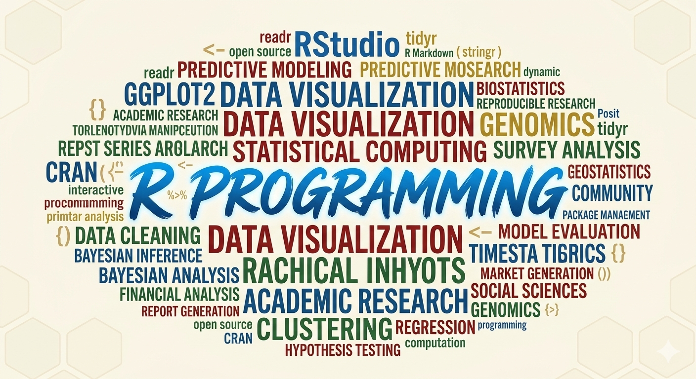
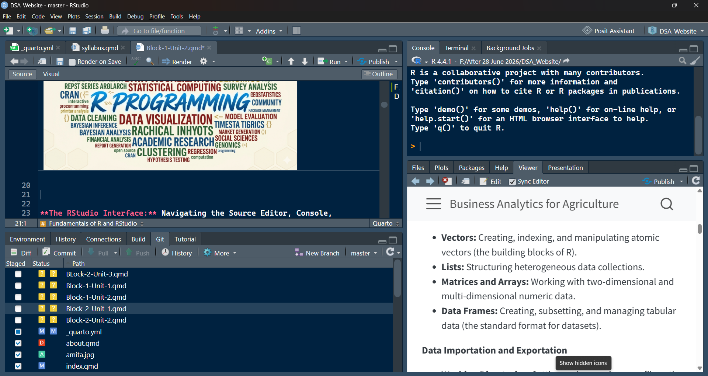
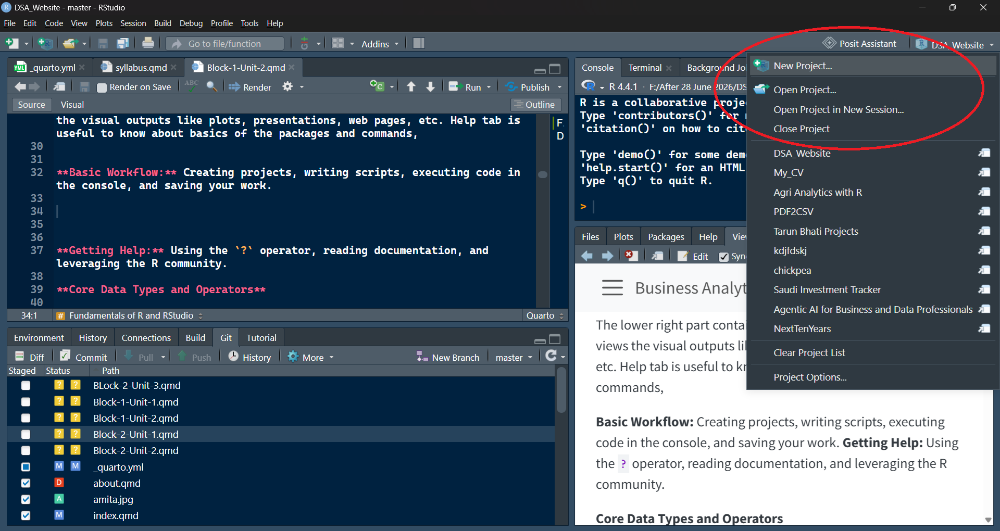
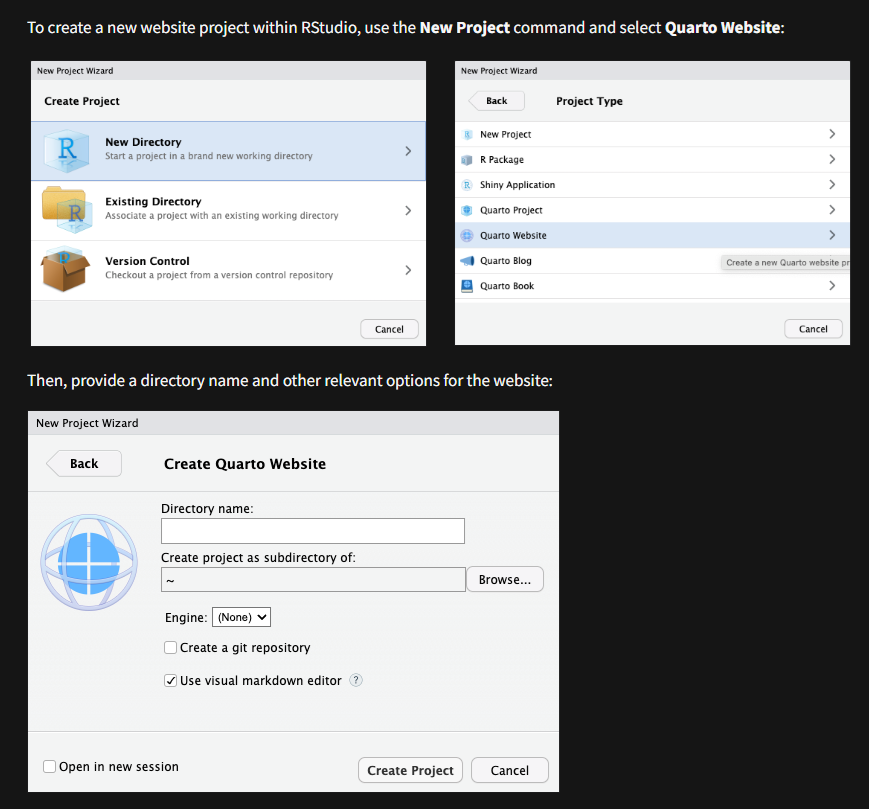
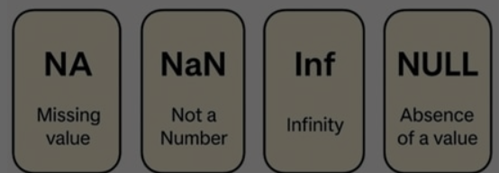
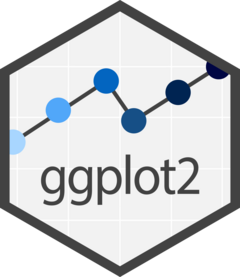
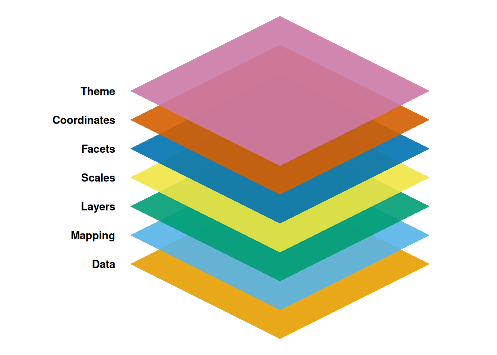
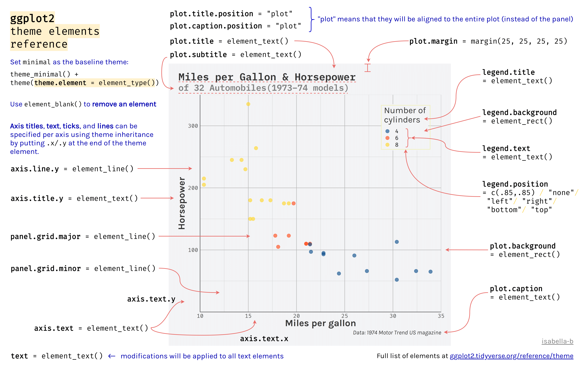

# Block I Unit 2

::: {.callout-note title="Chapter Outline"}

Fundamentals of R and RStudio, fundamentals of packages of RStudio, data manipulations, data transformations, normalization, standardization, missing values imputation, dummy variables, data visualization (2D and 3D), basic architecture of machine learning analytical cycle, descriptive analytics-case study covering data manipulation, measures of central tendency, measures of dispersion, measures of distribution, measures of associations, t-test, f-test, ANOVA, Chi-square test, basic statistical modeling framework.

:::

------------------------------------------------------------------------

## Fundamentals of R and RStudio

**Introduction to the R Ecosystem**

- **What is R and RStudio?**





The upper left part of Rstudio is script writing panel and used writing commands for the data science tasks.

The upper right part is console where we can see the output of the comands and terminal to access the terminal commands.

The lower left part shows the history of the project, environment and tutorials.

The lower right part contains the file structures of the projects, views the visual outputs like plots, presentations, web pages, etc. Help tab is useful to know about basics of the packages and commands.

------------------------------------------------------------------------

**Basic Workflow:** Creating projects, writing scripts, executing code in the console, and saving your work.



- Launch a Project by clicking on New Project
- Managing Project



------------------------------------------------------------------------

**Core Data Types and Operators**

- **Basic Data Types:** Working with numerics, integers, characters, logicals (boolean), and factors.

------------------------------------------------------------------------


------------------------------------------------------------------------

- **Basic Operators:** Implementing arithmetic `(+, -, *, /)`, assignment `(<-)`, and logical operators `(==, !=, <, >, >=, <=, &, |)`.

```{r}

2+2


```

```{r}

2-1


```

```{r}

2*3


```

```{r}

2/5


```

```{r}

D <- 3 + 5

D

```

```{r}

# 1. Setup sample data
x <- c(5, 12, 8)
y <- c(5, 3, 10)

# 2. Relational Operators (Returns a logical vector: TRUE or FALSE)
x == y   # Equal to?                -> TRUE FALSE FALSE
x != y   # Not equal to?            -> FALSE  TRUE  TRUE
x < y    # Less than?               -> FALSE FALSE  TRUE
x > y    # Greater than?            -> FALSE  TRUE FALSE
x <= y   # Less than or equal to?   -> TRUE FALSE  TRUE
x >= y   # Greater than or equal to?-> TRUE  TRUE FALSE

# 3. Logical Operators (Element-wise)
# Let's create two logical vectors
a <- c(TRUE, TRUE, FALSE)
b <- c(TRUE, FALSE, FALSE)

a & b    # Element-wise AND (Both must be TRUE) -> TRUE FALSE FALSE
a | b    # Element-wise OR (At least one TRUE)  -> TRUE  TRUE FALSE

```

- **Missing Data:** Understanding and identifying `NA`, `NaN`, and `NULL` values.



**R Data Structures**

- **Vectors:** Creating, indexing, and manipulating atomic vectors (the building blocks of R).

```{r}

# --- Using the combine function c() ---
numeric_vec   <- c(1.5, 2.8, 3.1)       # Double (numeric)
integer_vec   <- c(1L, 5L, 10L)         # Integer (note the 'L' suffix)
character_vec <- c("apple", "banana")   # Character (string)
logical_vec   <- c(TRUE, FALSE, TRUE)   # Logical (boolean)

numeric_vec
integer_vec
character_vec
logical_vec

```

```{r}

# --- Creating Sequences ---
seq_colon <- 1:10                       # Sequence from 1 to 10 by 1
seq_func  <- seq(from = 0, to = 1, by = 0.2) # c(0, 0.2, 0.4, 0.6, 0.8, 1.0)
seq_len   <- seq_len(5)                 # Safe sequence from 1 to 5

seq_colon

seq_func

seq_len

```

```{r}

# --- Creating Repeated Values ---
rep_vector <- rep(1:3, times = 3)       # c(1,2,3, 1,2,3, 1,2,3)
rep_each   <- rep(c("A", "B"), each = 2) # c("A", "A", "B", "B")

rep_vector
rep_each

```

- **Lists:** Structuring heterogeneous data collections.

List can contain any sort of data with varying length and formats.

```{r}

list_all = list(
                 numeric_vec,
                 integer_vec,
                 character_vec,
                 logical_vec,

                 seq_colon,
                 seq_func,
                 seq_len,

                 rep_vector,
                 rep_each

)

list_all

```

- **Matrices and Arrays:** Working with two-dimensional and multi-dimensional numeric data.

```{r}

# --- Creating a 3D Array ---
# Let's create an array with 3 rows, 4 columns, and 2 layers (3 x 4 x 2)
arr <- array(1:24, dim = c(3, 4, 2))

# --- Indexing & Subsetting ---
arr[1, 2, 1]  # Row 1, Column 2, Layer 1
arr[, , 2]    # Extracts the entire 2nd Layer (returns a 2D matrix)
arr[2, , ]    # Extracts Row 2 across all columns and layers

# --- Manipulating & Summarizing Arrays ---
# Apply a function across specific dimensions using apply()
# Calculate column sums for each layer (Margin 2 = Columns)
apply(arr, MARGIN = 2, FUN = sum)

# Combine two arrays along a dimension using abind (requires library)
# install.packages("abind")
# library(abind)
# combined_arr <- abind(arr, arr, along = 3) # Creates a 3 x 4 x 4 array

arr

```

- **Data Frames:** Creating, subsetting, and managing tabular data (the standard format for datasets).

```{r}

# --- Base R: Creating a Data Frame ---
df <- data.frame(
  employee_id = c(101, 102, 103, 104),
  name        = c("Alice", "Bob", "Charlie", "David"),
  salary      = c(75000, 62000, 81000, 95000),
  remote      = c(TRUE, FALSE, TRUE, TRUE),
  stringsAsFactors = FALSE # Standard practice in modern R
)

# --- Tidyverse: Creating a Tibble ---
# Note: Requires installing/loading the library: install.packages("tidyverse")
library(tibble)

tb <- tibble(
  employee_id = c(101, 102, 103, 104),
  name        = c("Alice", "Bob", "Charlie", "David"),
  salary      = c(75000, 62000, 81000, 95000),
  remote      = c(TRUE, FALSE, TRUE, TRUE)
)

df

tb

```

```{r}

# --- Subsetting Columns (Variables) ---
df$name               # Returns the "name" column as a vector
df[["salary"]]        # Also returns "salary" as a vector
df[, c("name", "salary")] # Returns a data frame with just those two columns

# --- Subsetting Rows (Observations) ---
df[1, ]               # Extracts the entire 1st row
df[1:3, ]             # Extracts rows 1 through 3

# --- Logical Subsetting (Filtering Rows) ---
# Find employees making more than $70,000
df[df$salary > 70000, ]

# Find employees who are remote AND making more than $80,000
df[df$remote == TRUE & df$salary > 80000, ]

```

```{r}

# --- Inspecting the Dataset ---
head(df, n = 2)       # View the first 2 rows
dim(df)               # Returns number of rows and columns (e.g., 4 4)
str(df)               # Displays the structure, data types, and contents
summary(df)           # Provides statistical summaries of numeric columns

# --- Adding and Modifying Columns ---
# Add a new column based on calculation
df$bonus <- df$salary * 0.10 

# Modify an existing column
df$salary <- df$salary + 2000

# --- Adding Rows ---
new_employee <- data.frame(employee_id = 105, name = "Eva", salary = 68000, remote = FALSE, bonus = 6800)
df <- rbind(df, new_employee)

# --- Sorting (Ordering) Data ---
# Sort the entire dataset by salary in descending order (-)
df_sorted <- df[order(-df$salary), ]

# --- Handling Missing Data (NA) ---
# Check which rows have missing data
is.na(df)

# Remove any rows containing missing values completely
df_clean <- na.omit(df)

```

**Data Importation and Exportation**

- **Working Directories:** Setting and managing your file paths using R projects.

_The Problem R Projects Solve_

New R users often write `setwd("C:/Users/Arun/Desktop/data")` at the top of every script. This breaks the moment the script moves to another computer, another folder, or another person's laptop. R Projects fix this permanently.

_Setting It Up_

1. **Create a Project**: File → New Project → New Directory (or Existing Directory) → give it a name.

2. This creates a `.Rproj` file in that folder — this file IS the anchor. Wherever this file sits, that becomes "home" whenever you open the project.

3. Double-click the `.Rproj` file (or open via RStudio's Project menu) to launch — RStudio automatically sets the working directory to that folder. **No `setwd()` needed, ever.**

_The One Rule to Teach_

**Never use `setwd()` with absolute paths. Always use paths relative to the project root.**

Instead of:

```{r}
#data <- read.csv("C:/Users/Arun/Desktop/MyProject/data/sales.csv")
```

Write:

```{r}
#data <- read.csv("data/sales.csv")
```

_Recommended Folder Structure_

Have students create this inside every new project:

MyProject/
├── MyProject.Rproj
├── data/          (raw data, never edited manually)
├── scripts/        (.R or .qmd files)
├── output/        (plots, results, reports)
└── README.md

_The `here` Package (strongly recommend)_

Even relative paths can break if a script is sourced from a subfolder. The `here` package solves this:

```{r}
#install.packages("here")
library(here)

#data <- read.csv(here("data", "sales.csv"))
#ggsave(here("output", "plot1.png"))
```

`here()` always resolves from the project root, no matter which subfolder the script runs from. Make this a habit from day one — it saves enormous debugging pain later.

_Quick Checklist for Students_

- [ ] Every analysis lives inside its own `.Rproj`
- [ ] Never hardcode a personal folder path
- [ ] Use `data/`, `scripts/`, `output/` subfolders
- [ ] Use `here::here()` instead of raw relative strings
- [ ] Check working directory anytime with `getwd()` — should always show the project folder

**Data Manipulation (Introduction to the Tidyverse)**

_Setup_

```{r}
library(tidyverse)
head(diamonds)  # already loaded, ~54,000 rows
```

1. The Pipe Operator

Both `%>%` and `|>` do the same thing — pass the object on the left into the function on the right.

```{r}
# Native pipe (R 4.1+) - recommended for students today
diamonds |> head()

# magrittr pipe - older, still common in tutorials/code online
diamonds %>% head()
```

2. Filtering and Selecting

```{r}
diamonds |>
  filter(cut == "Ideal", price > 5000) |>   # rows: only Ideal cut, expensive
  select(carat, cut, price, color)           # columns: keep only these
```

3. Sorting and Mutating

```{r}
diamonds |>
  mutate(price_per_carat = price / carat) |>   # new variable
  arrange(desc(price_per_carat)) |>            # sort, highest first
  select(carat, price, price_per_carat)
```

4. Summarizing Data

```{r}
diamonds |>
  group_by(cut) |>
  summarize(
    avg_price = mean(price),
    total_sales = sum(price),
    count = n()
  ) |>
  arrange(desc(total_sales))
```

This is the exercise that shows *why* the pipe matters — one readable chain instead of nested function calls:

```{r}
diamonds |>
  filter(price > 1000) |>
  mutate(price_per_carat = price / carat) |>
  group_by(color) |>
  summarize(
    avg_price = mean(price),
    avg_ppc = mean(price_per_carat),
    n = n()
  ) |>
  arrange(desc(avg_price))
```

**Pipe operators Reads left to right like a sentence:** *"Take diamonds, filter for price above 1000, create price-per-carat, group by color, summarize, then sort by average price descending."**

## Quick Exercise

Find: *"Which diamond `clarity` grade has the highest average price per carat, considering only diamonds under 2 carats?"*

HINT: `filter → mutate → group_by → summarize → arrange`


**Basic Data Visualization**

- **Base R Graphics:** Creating quick plots using `plot()`, `hist()`, and `boxplot()`.

```{r}

data("trees")

plot(trees$Girth, trees$Volume)

```


```{r}

hist(trees$Girth, n=30)

```


```{r}

boxplot(trees$Girth, horizontal = TRUE)

```


- **Introduction to ggplot2:** Understanding the grammar of graphics (Data, Aesthetics, Geoms).



`ggplot2` is the most versatile package to create basic to the advance level graphics and plots. You can visit the  [GGPLOT gallery](https://r-graph-gallery.com/), learn more about GGPLOT from this [LINK](https://ggplot2.tidyverse.org/articles/ggplot2.html) to see what `ggplot2` package is capable of. Checkout the [GGPLOT2 CHEATSHEET](https://rstudio.github.io/cheatsheets/html/data-visualization.html) and dedicated book [Data Visualization](https://r4ds.had.co.nz/data-visualisation.html). 

Some experts have used GGPLOT2 to create artistic plots and build career in data visualization and storytelling. Check following profiles of ggplot artists:

- [Riffomonas Project](riffomonas.org)

- [Albert Rapp](https://www.youtube.com/@rappa753)

- [Milo Makes Maps](https://www.youtube.com/@milos-makes-maps)

- **Essential Plot Types:** Building scatter plots, bar charts, line graphs, and histograms.
- **Customizing Plots:** Adding titles, changing axis labels, and applying basic themes.

_Anatomy of a Plot_

A plot is made up of layers shown as following:



_Components of a plot_

Therr are variety of components that make a plot. The following image shows the plot components and corresponding command from ggplot package to create that element:


Source: [Author Isabella Benabaye](https://share.google/vzISynxyvpx0seAnv)

_Steps to create a basic ggplot_

```{r}

# 1. Call the ggplot2 package from library

library(ggplot2)

# 2. Load data in ggplot

ggplot(data = ChickWeight)

# 3. Add aesthetics (x and y axis)

ggplot(data= ChickWeight, aes(x=Time, y=weight))

# 4. Add layers of type of plot, transformation or position adjustment using geoms

ggplot(data = ChickWeight, aes(x=Time, y=weight)) +
  geom_point() +                      #To create scatter plot
  geom_smooth(formula = y ~x, method = "lm")

# 5. Adding Scales to differentiate the different segments

ggplot(data = ChickWeight, aes(x=Time, y=weight, colour = as.factor(Diet))) +
  geom_point() +                      #To create scatter plot
  geom_smooth(formula = y ~x, method = "loess") + # Setting leoss rgression line
  scale_colour_viridis_d()    # Scale

# 6. Subsetting plot into facets if required

ggplot(data = ChickWeight, aes(x=Time, y=weight)) +
  geom_point() +                      #To create scatter plot
  facet_wrap(~Diet)                  # To create facets

# 7. Coordinates setting

ggplot(data = ChickWeight, aes(x=Time, y=weight)) +
  geom_point() +                      #To create scatter plot
  coord_fixed()                       # To set coordinates fixed ratio  as per scale

ggplot(data = ChickWeight, aes(x=Time, y=weight)) +
  geom_point() +                      #To create scatter plot
  coord_fixed(0.5)                       # To set coordinates fixed ratio  as per choice


ggplot(data = ChickWeight, aes(x=Time, y=weight)) +
  geom_point() +                      #To create scatter plot
  coord_fixed(1.5)                       # To set coordinates fixed ratio  as per choice

ggplot(data = ChickWeight, aes(x=Time, y=weight)) +
  geom_point() +                      #To create scatter plot
  coord_fixed(0.01)                       # To set coordinates fixed ratio  as per choice

# 8. Adding theme to the plot (title, subtitle, axis label, plot background, graph background, caption, annotation, font size, font type, font formats, etc.)

ggplot(data = ChickWeight, aes(x=Time, y=weight, colour = Diet)) +
  geom_point() +                      #To create scatter plot
  coord_fixed(0.01) +                 # To set coordinates
  labs(
    title = "Chick Development Analysis",
    subtitle = "Outcomes of an experiment with 578 Chicks",
    caption = "Study done by students of Agri MBA-2 Batch 2024-26 in May 2026 at IABM",
    x = "Time in Days",
    y = "Weight in gram"
  ) +
  theme(
      plot.title = element_text(face = "bold", size = 14),
      plot.subtitle = element_text(face = "bold", size = 9, color="grey70"),
      axis.title.y = element_text(color = "darkblue"),
      axis.title.x = element_text(color = "darkgreen")
    )

```


:::{.callout-important title= "Assignment 2.1"}

Use any inbuilt dataset in R and create 5 different visuals using `ggplot2` package. (Visit GGplot Gallery for the help).

:::

---

**Programming Fundamentals in R**

- **Conditional Logic:** Writing `if`, `else if`, and `else` statements.

_Basic Syntax_


if (condition) {
  # code if TRUE
} else if (another_condition) {
  # code if that's TRUE
} else {
  # code if none are TRUE
}


Example 1: Simple `if`

```{r}
age <- 20

if (age >= 18) {
  print("You are an adult")
}
```

Try changing age value 15, 17.5 and 21 and check if else statement is properly working or not.

Example 2: `if` / `else`

```{r}
marks <- 45

if (marks >= 40) {
  print("Pass")
} else {
  print("Fail")
}
```

Check the if lese statement command for marks 35 and 50.

Example 3: `if` / `else if` / `else` (grading system)

```{r}
marks <- 78

if (marks >= 90) {
  print("Grade: A")
} else if (marks >= 75) {
  print("Grade: B")
} else if (marks >= 60) {
  print("Grade: C")
} else if (marks >= 40) {
  print("Grade: D")
} else {
  print("Grade: F")
}
```

Check the Grade for Marks 40, 70, and 90.

Example 4: Using it inside a function (practical, real-world style)

```{r}
check_bmi <- function(bmi) {
  if (bmi < 18.5) {
    return("Underweight")
  } else if (bmi < 25) {
    return("Normal")
  } else if (bmi < 30) {
    return("Overweight")
  } else {
    return("Obese")
  }
}

check_bmi(27)   # "Overweight"
check_bmi(21)   # "Normal"
```

Example 5: Vectorized alternative — `ifelse()`

Regular `if` only checks **one value at a time**. When you need to apply a condition across an entire column/vector (very common with sales/data work), use `ifelse()` instead:

```{r}
scores <- c(45, 88, 62, 30, 95)

result <- ifelse(scores >= 50, "Pass", "Fail")
print(result)

```

Common Mistake to Warn Students About

`else` **must** be on the same line as the closing `}` of the `if` block — otherwise R throws an error (especially when running line-by-line in a script).

```{r}
# # WRONG (in a script run line-by-line)
# if (age >= 18) {
#   print("Adult")
# }
# else {
#   print("Minor")
# }

# CORRECT
if (age >= 18) {
  print("Adult")
} else {
  print("Minor")
}
```

**Quick Exercise**

Write a function `classify_diamond(price)` that returns `"Budget"` if price < 1000, `"Mid-range"` if price < 5000, and `"Luxury"` otherwise — then test it using values pulled from the `diamonds$price` column.

---

- **Vectorized Operations:** Leveraging R's native speed instead of traditional loops.

_The Core Idea_

R is built to operate on entire vectors at once, not element-by-element like traditional loops. Vectorized code is faster, shorter, and more "R-like."

```{r}
x <- c(1, 2, 3, 4, 5)
x * 2
# 2 4 6 8 10   — every element multiplied, no loop needed
```

Example 1: Loop vs. Vectorized (the classic comparison)

**Slow, traditional way (loop):**

```{r}
x <- 1:1000000
result <- numeric(length(x))

for (i in seq_along(x)) {
  result[i] <- x[i] * 2
}
```

**Fast, vectorized way:**
```{r}
x <- 1:1000000
result <- x * 2
```

Same output — but the vectorized version runs dramatically faster because R's internal C code handles the looping, not R itself.

Example 2: Conditional Logic — `ifelse()` Instead of a Loop

```{r}
scores <- c(45, 88, 62, 30, 95)

# Loop way (avoid this)
result <- character(length(scores))
for (i in seq_along(scores)) {
  if (scores[i] >= 50) result[i] <- "Pass" else result[i] <- "Fail"
}

# Vectorized way (do this)
result <- ifelse(scores >= 50, "Pass", "Fail")
```

Example 3: Applying a Function Across a Vector

```{r}
prices <- c(1200, 450, 3400, 800, 5200)

# No loop needed — sqrt() is already vectorized
sqrt(prices)

# Custom logic without a loop, using ifelse()
category <- ifelse(prices < 1000, "Budget",
             ifelse(prices < 5000, "Mid-range", "Luxury"))
```

Example 4: Vectorized Math on Data Frame Columns

```{r}
diamonds$price_per_carat <- diamonds$price / diamonds$carat
```

No loop, no `apply()` — one line operates on all ~54,000 rows simultaneously.

Example 5: Logical Indexing (a vectorized filter)

```{r}
x <- c(10, 25, 3, 47, 8, 62)

x[x > 20]        # 25 47 62 — pulls all elements matching the condition
sum(x > 20)      # 3 — counts how many meet the condition
```

When You *Do* Still Need a Loop

Vectorization doesn't cover everything — use loops when each step depends on the *previous* result (e.g., simulations, recursive calculations):

```{r}
balance <- numeric(10)
balance[1] <- 1000
for (i in 2:10) {
  balance[i] <- balance[i-1] * 1.05   # depends on prior value
}
```

The Rule of Thumb to Teach

**If you're writing a `for` loop to do simple math or apply a condition to a whole column — stop. There's almost always a vectorized way.**

**Quick Exercise**

Here is the 20 chick weights:

60, 120, 221, 175, 80,
280, 305, 155, 98, 103,
200, 190, 352, 75, 180,
210, 198, 98, 98, 170

Classify each chick as `"Low"`, `"Medium"`, or `"High"` using nested `ifelse()` — then time it against a loop-based version using `system.time()` to see the speed difference themselves.


- **Basic Loops:** Understanding `for` and `while` loops for repetitive tasks.

_`for` Loop — When You Know How Many Times to Repeat_

```{r}
for (i in 1:5) {
  print(i)
}
# 1 2 3 4 5
```

Example 1: Looping Over a Vector

```{r}
fruits <- c("Apple", "Banana", "Mango")

for (f in fruits) {
  print(paste("I like", f))
}
```

Example 2: Looping With an Index (common in data work)

```{r}
prices <- c(100, 250, 400)

for (i in 1:length(prices)) {
  cat("Item", i, "costs Rs.", prices[i], "\n")
}
```

**Tip:** prefer `seq_along(prices)` over `1:length(prices)` — it safely handles an empty vector (`1:0` gives `1, 0`, which breaks the loop).

```{r}
for (i in seq_along(prices)) {
  cat("Item", i, "costs Rs.", prices[i], "\n")
}
```

Example 3: Accumulating a Result

```{r}
total <- 0
sales <- c(1200, 450, 3400, 800)

for (s in sales) {
  total <- total + s
}
print(total)   # 5850
```

(Note: `sum(sales)` does this in one vectorized line — loops are for teaching the *concept*, but real code should prefer vectorization once understood.)

_`while` Loop — When You Don't Know the Number of Iterations in Advance_

Repeats **as long as a condition stays TRUE**.

```{r}
count <- 1

while (count <= 5) {
  print(count)
  count <- count + 1
}
```


Example 4: `while` Loop — Practical Case (compounding until a target is hit)

```{r}
balance <- 1000
years <- 0

while (balance < 2000) {
  balance <- balance * 1.08   # 8% annual growth
  years <- years + 1
}

cat("It took", years, "years to double the balance.\n")
```

This is the kind of problem `while` is made for — you genuinely don't know the iteration count upfront.

_`break` and `next` — Controlling Loop Flow_

```{r}
# break — stop the loop early
for (i in 1:10) {
  if (i == 5) break
  print(i)
}
# 1 2 3 4

# next — skip this iteration, continue looping
for (i in 1:10) {
  if (i %% 2 == 0) next   # skip even numbers
  print(i)
}
# 1 3 5 7 9
```

_Common Mistake to Warn Students About_

Forgetting to update the counter in a `while` loop causes an **infinite loop**:

```{r}
# WRONG — never stops
#count <- 1
#while (count <= 5) {
#  print(count)
  # forgot: count <- count + 1
#}
```

If this happens in RStudio, hit the **red stop icon** (or `Esc`) to break out.

_`for` vs `while` — Quick Rule of Thumb_

| Use `for` when... | Use `while` when... |
|---|---|
| You know the number of iterations | You don't know how many iterations you'll need |
| Looping over a fixed vector/list | Looping until a condition is met |

**Quick Exercise**

Using a `while` loop,  find how many months it takes an LIC premium of ₹5,000 growing at 0.5% monthly interest to cross ₹6,000 — then solve the same problem with a `for` loop capped at 50 iterations using `break` once the target is hit.

---

- **Writing Custom Functions:** Building reusable code blocks with inputs and outputs.

_Basic Syntax_

```r
function_name <- function(arg1, arg2) {
  # code using arg1, arg2
  return(result)
}
```

Example 1: Simple Function

```{r}
square <- function(x) {
  return(x^2)
}

square(5)   # 25
```


Example 2: Multiple Arguments

```{r}
calculate_bmi <- function(weight, height) {
  bmi <- weight / (height^2)
  return(bmi)
}

calculate_bmi(70, 1.75)   # 22.86
```

Example 3: Default Argument Values

```{r}
greet <- function(name, greeting = "Hello") {
  paste(greeting, name)
}

greet("Amita")                    # "Hello Arun"
greet("Amita", "Good morning")    # "Good morning Arun"
```

Example 4: Combining a Function With `if`/`else` (very common pattern)

```{r}
classify_diamond <- function(price) {
  if (price < 1000) {
    return("Budget")
  } else if (price < 5000) {
    return("Mid-range")
  } else {
    return("Luxury")
  }
}

classify_diamond(3200)   # "Mid-range"
```

Example 5: Function That Returns Multiple Values (via a list)

```{r}
sales_summary <- function(sales) {
  list(
    total = sum(sales),
    average = mean(sales),
    highest = max(sales)
  )
}

result <- sales_summary(c(1200, 450, 3400, 800))
result$total      # 5850
result$average    # 1462.5
result$highest    # 3400
```


Example 6: A Vectorized Custom Function (works on a whole column, no loop)

```{r}
premium_with_gst <- function(base_premium, gst_rate = 0.18) {
  base_premium * (1 + gst_rate)
}

# Works on a single value
premium_with_gst(5000)          # 5900

# Also works on an entire vector at once — no loop needed
premiums <- c(5000, 8000, 12000)
premium_with_gst(premiums)      # 5900  9440  14160
```

**Quick Exercise**

Write a function `lic_maturity(premium, years, rate = 0.06)` that calculates simple maturity value as `premium * years * (1 + rate)`, then apply it to a vector of different premium amounts to show it working without a loop.

---

**Introduction to Git & GitHub**

- **Version Control Concepts:** Understanding repositories, commits, branching, and remote hosting.
- **RStudio Git Integration:** Setting up Git inside RStudio, staging changes, writing commit messages, and pushing/pulling code.
- **Transitioning from R Markdown to Quarto:** Understanding the unified syntax of Quarto (`.qmd`) as the next-generation version of R Markdown (`.Rmd`).
- **Quarto Document Anatomy:** Working with the YAML header, text formatting using markdown, and configuring executable R code chunks.
- **Dynamic Document Generation:** Rendering a single source file into multiple output formats including HTML, PDF, and MS Word.

**Dashboards, Shiny Apps, eBooks and Reproducible Reports**

- **Quarto Dashboards:** Building interactive, responsive grid layouts with rows, columns, tabs, and value boxes directly from markdown.
- **Introduction to Shiny:** Understanding the foundational architecture of Shiny applications (User Interface `ui` vs. Server logic `server`).
- **Reactive Programming:** Harnessing reactive values, expressions, and observers to update web app outputs dynamically based on user inputs.
- **Publishing eBooks and Websites:** Structuring multi-file projects using `_quarto.yml` to compile complete books, documentation sites, or blogs.
- **Reproducible Report Workflows:** Best practices for parameters (`params`), caching computational steps, and freezing execution for stable builds.

**R/Posit Communities**

- **Navigating the Ecosystem:** Utilizing official Posit community forums, package documentation, and standardized cheat sheets.
- **Collaborative Learning Networks:** Engaging with regional R User Groups (RUGs), R-Ladies chapters, and the global `#rstats` community.
- **Continuous Skill Building:** Leveraging open source initiatives like *TidyTuesday* to practice data manipulation and visualization safely.

**Other Parts of R Ecosystem**

- **Package Management Lifecycle:** Installing, updating, and loading extensions safely using `install.packages()`, `library()`, and CRAN mirrors.
- **Reproducible Environments:** Introduction to `renv` for locking down package versions to prevent project-breaking dependency updates.
- **Specialised R Sub-Ecosystems:** A high-level overview of ecosystem expansions like `tidymodels` for machine learning and `sf` / `terra` for geospatial analysis.

------------------------------------------------------------------------

## Data Preprocessing, Machine Learning Cycle & Inferential Statistics

**Data Transformations and Preprocessing**

- **Normalization (Min-Max Scaling):** Rescaling feature values to a constrained range between 0 and 1.
- **Standardization (Z-Score Scaling):** Transforming features to have a mean of 0 and a standard deviation of 1.
- **Missing Values Imputation:** Evaluating strategies for handling incomplete data, including listwise deletion, mean/median substitution, and predictive imputation using `mice` or `missMDA`.
- **Dummy Variables (One-Hot Encoding):** Converting categorical string values into numerical binary vectors (`0` or `1`) for machine learning models.

**Advanced Data Visualization**

- **Advanced 2D Visualizations:** Creating complex multilayered charts, faceting plots via `facet_wrap()`, and adding custom statistical annotations.
- **Introduction to 3D Data Visualization:** Visualizing spatial, topographical, or surface metrics using interactive toolsets like `plotly` or `rayshader`.

**Basic Architecture of Machine Learning Analytical Cycle**

- **Problem Formulation & Data Collection:** Defining predictive tasks (Classification vs. Regression) and gathering primary structural observations.
- **Data Cleansing & Feature Engineering:** Formatting raw records, refining variables, and performing exploratory data analysis (EDA).
- **Model Training & Evaluation:** Partitioning datasets into Train/Test splits, validating model performance with metrics (RMSE, Accuracy), and tuning hyperparameters.
- **Deployment & Monitoring:** Packaging analytical cycles into reproducible code pipelines or production environments.

**Descriptive Analytics Case Study (Covering Data Manipulation)**

- **Measures of Central Tendency:** Computing and interpreting the Median, Mean, and Mode for varying structural distributions.
- **Measures of Dispersion:** Quantifying variability across variables via Range, Variance, Standard Deviation, and Interquartile Range (IQR).
- **Measures of Distribution:** Analysing the structural shapes of data spreads using Skewness (asymmetry) and Kurtosis (tailedness).
- **Measures of Association:** Computing Covariance and Correlation matrices (Pearson vs. Spearman) to evaluate linear and rank dependencies between numerical features.

**Hypothesis Testing & Statistical Modeling Framework**

- **Student’s t-Test:** Performing Independent, Paired, and One-sample t-tests to evaluate differences between continuous group means.
- **F-Test:** Testing for equality of variances between two independent populations.
- **Analysis of Variance (ANOVA):** Implementing One-Way and Two-Way ANOVA models to analyze variance across three or more unique treatment groups.
- **Chi-Square Test:** Running Test of Independence and Goodness-of-Fit procedures using contingency tables for categorical attributes.
- **Basic Statistical Modeling Framework:** Foundational setup for Generalized Linear Models (GLMs), defining response variables, predictor metrics, and interpreting residual summaries.
